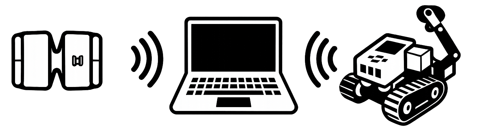

# ev3-myo #
 
## To use the project, you will need the following hardware ## 
* [LEGO Mindstorms EV3](https://www.lego.com/en-us/mindstorms/products/mindstorms-ev3-31313) 
	* Follow [online assembly instructions](https://www.lego.com/r/www/r/mindstorms/-/media/franchises/mindstorms%202014/downloads/bi/31313_track3r_2016.pdf?l.r2=746618505) (pages 4-17, 20-27, 70-81) 
* [Myo Armband](https://www.myo.com/) 
* Bluetooth enabled computer with Windows OS 
* SD card for LEGO Mindstorms EV3 to install the leJOS firmware 
## To compile the ev3-myo subproject and get it working, you will require ## 
* [JDK](http://www.oracle.com/technetwork/java/javase/downloads/jre8-downloads-2133155.html) (tested on Java SE 8 Update 181) 
* [Myo Connect](https://developer.thalmic.com/downloads) 
* [Eclipse IDE for Java Developers](https://www.eclipse.org/downloads/) (tested on Oxygen.3a Release (4.7.3a)) 
* [leJOS firmware](https://sourceforge.net/projects/ev3.lejos.p/files/0.9.1-beta/) on you EV3 brick (installation instructions: [1](https://sourceforge.net/p/lejos/wiki/Home/), [2](https://sourceforge.net/p/lejos/wiki/Installing%20leJOS/), [3](https://sourceforge.net/p/lejos/wiki/Windows%20Installation/)) 
* [Maven](https://maven.apache.org/download.cgi) 
	* [Installation instructions](https://maven.apache.org/install.html) 
	* To get required dependencies open cmd and move to ev3-myo subfolder, which contains the pom.xml file, using `cd` and then run the command `mvn eclipse:eclipse` (can also be done via the Eclipse GUI). 
* [Pair the EV3 brick with your computer via Bluetooth and create PAN](https://sourceforge.net/p/lejos/wiki/Configuring%20Bluetooth%20PAN/) 
	* Every time you reboot or disconnect from the Bluetooth PAN and you want to work with the EV3 brick again, you need to go to Control Panel > Hardware and Sound > Devices and Printers > right-click on you EV3 brick > Connect using > Access point to connect to the EV3 brick. You can also create a shortcut. 
* [leJOS plugin for Eclipse](https://sourceforge.net/p/lejos/wiki/Installing%20the%20Eclipse%20plugin/) offers some additional functions for the LEGO Mindstorms EV3 brick via Eclipse, however it is not required to run the project. 
## To train your own models using the neural-net subproject, you will require ## 
* [Anaconda](https://www.anaconda.com/download/) 
	* Use Jupyter Notebook to open the neural-net.ipynb file in the neural-net subfolder. 
* [Tensorflow library](https://www.tensorflow.org/install/install_windows) (tested with version GPU 1.9.0) 
## Project structure ## 
* _models 
	* Pretrained Keras model for the given task 
* _readings 
	* EMG and IMU readings from the Myo armband used for neural network training 
* ev3-myo 
	* The main project in Java that enables robot control as well as EMG and IMU recording
* neural-net 
	* Python script for training the neural network using EMG and IMU recordings
## Disclaimer ##
Some of the code is hacky at best. This is meant as a working prototype.
